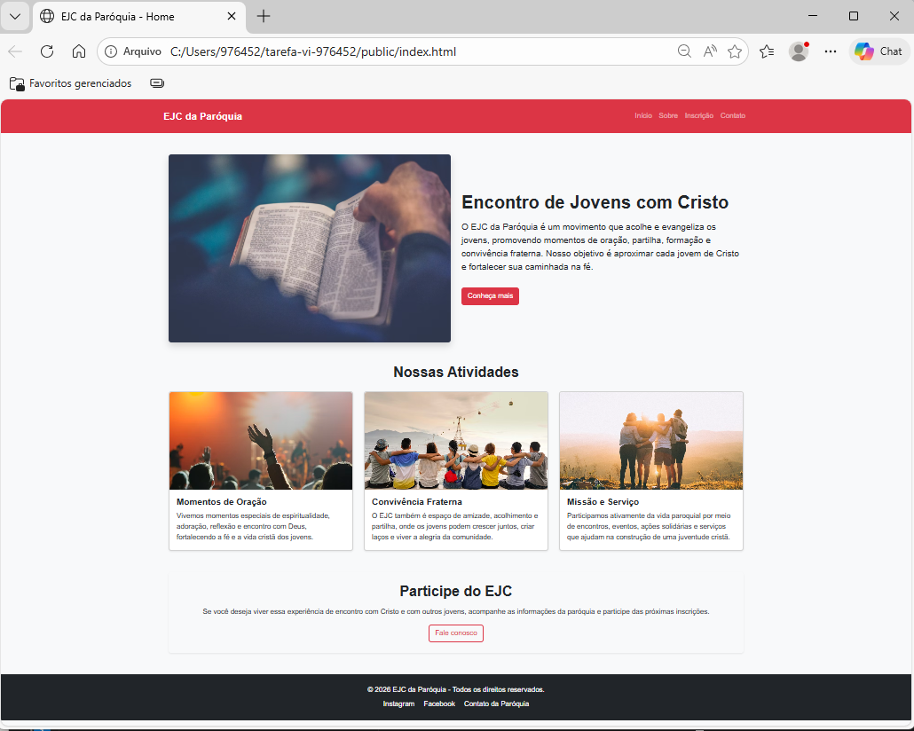

# Projeto Responsivo com Bootstrap - EJC da Paróquia

## Aluna
Maria Luiza Aparecida Trindade de Meneses

## Descrição do Projeto
Este projeto consiste na evolução da home-page desenvolvida na atividade anterior, mantendo o tema do **EJC da Paróquia** e refatorando a responsividade com o uso do framework Bootstrap.

A proposta foi substituir os recursos nativos de responsividade utilizados anteriormente (como media queries, flexbox e grid em CSS puro) pelos recursos oferecidos pelo Bootstrap, mantendo a organização visual da página e melhorando a adaptação entre diferentes dispositivos.

## Estrutura da Home Page
A página contém os seguintes elementos obrigatórios:

- **Header**
  - Nome do site: EJC da Paróquia
  - Barra de navegação com 4 links internos

- **Main**
  - Banner principal
  - Texto introdutório sobre o Encontro de Jovens com Cristo

- **Section**
  - 3 cards informativos
  - Cada card contém imagem, título e descrição

- **Footer**
  - Informações institucionais
  - Links para contato e redes sociais

## Tecnologias Utilizadas
- HTML5
- CSS3
- Bootstrap 5 (via CDN)
- Git e GitHub

## Responsividade
A responsividade foi implementada utilizando o sistema de grid do Bootstrap, permitindo:

- Exibição em **duas colunas na versão desktop**
- Ajuste automático para **uma coluna em dispositivos móveis**
- Organização responsiva dos cards em diferentes tamanhos de tela

## Prints do Projeto

### Versão Desktop

### Versão Mobile

## Repositório
A URL do repositório foi enviada no Canvas conforme solicitado.